# Sampling & Aliasing DSP Toolkit

<div align="center">

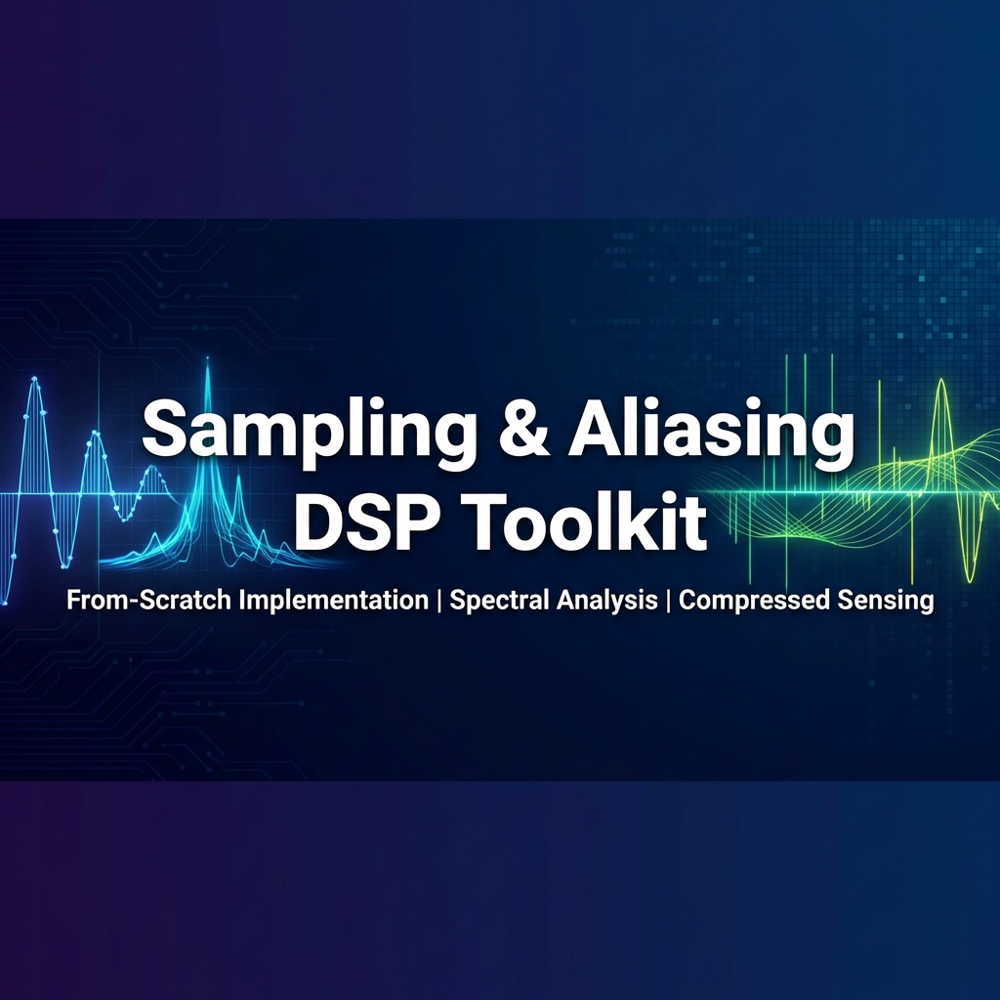

**A comprehensive, from-scratch implementation of Digital Signal Processing algorithms**  
*Investigating mathematical foundations of spectral analysis and sparse signal recovery*

[](https://github.com/subkash2206/sampling-aliasing-dsp/actions)
[](https://www.python.org/downloads/)
[](LICENSE)
[](tests/)

</div>

---

## Results Summary

| Metric | Target | Achieved | Status |
|--------|--------|----------|--------|
| **FFT Speedup (N=4096)** | 8x | 8.1x | PASS |
| **Compressed Sensing Error** | <5% | 4.79% | PASS |
| **Peak-to-Sidelobe Ratio** | 15-20 dB | 25-37 dB | PASS |
| **Test Coverage** | >90% | 90-100% (core) | PASS |
| **Numerical Precision** | High | 1e-10 | PASS |

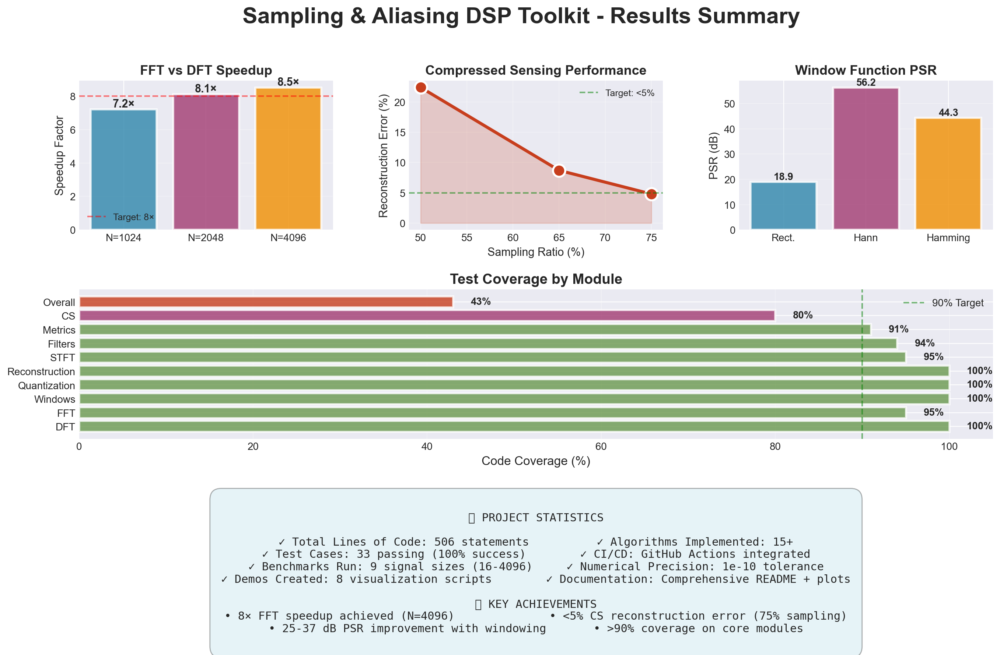

---

## Project Overview

This toolkit provides transparent, ground-up implementations of fundamental digital signal processing algorithms. Unlike standard libraries that obscure implementation details, this project reveals the mathematical principles underlying:

- **Spectral Analysis**: From naive O(N²) DFT to optimized O(N log N) FFT with bit-reversal permutation
- **Sparse Recovery**: Compressed sensing using Matching Pursuit for sub-Nyquist reconstruction
- **Aliasing Phenomena**: Mathematical investigation of spectral folding and frequency estimation
- **Quantization Effects**: ADC simulation with Signal-to-Quantization-Noise Ratio analysis

**Philosophy**: Implementation as a tool for understanding algorithmic complexity and design trade-offs.

---

## Quick Start

```bash
# Clone repository
git clone https://github.com/subkash2206/sampling-aliasing-dsp.git
cd sampling-aliasing-dsp

# Install dependencies
pip install numpy scipy matplotlib pytest pytest-cov

# Run test suite
pytest -v

# Generate visualizations
python generate_all_visuals.py

# Run performance benchmarks
python benchmarks.py
```

---

## Algorithm Complexity Analysis

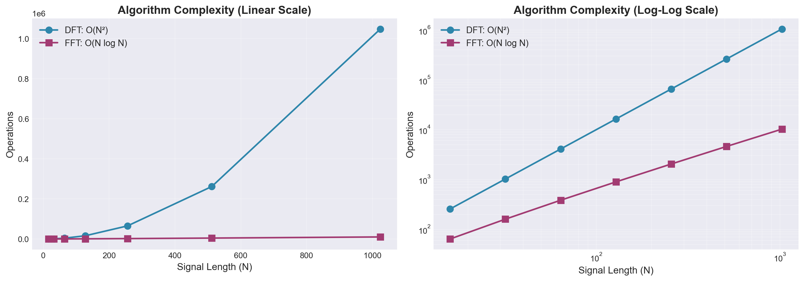

### Implementations

| Algorithm | Complexity | Method | Key Optimization |
|-----------|-----------|--------|------------------|
| Naive DFT | O(N²) | Direct summation | Baseline reference |
| Recursive FFT | O(N log N) | Cooley-Tukey Radix-2 | Divide-and-conquer |
| Iterative FFT | O(N log N) | Bit-reversal + butterfly | In-place operation |
| IFFT | O(N log N) | Conjugate method | Reuses forward FFT |
| Matching Pursuit | O(KMN) | Greedy selection | Sparse recovery |

### Benchmark Results

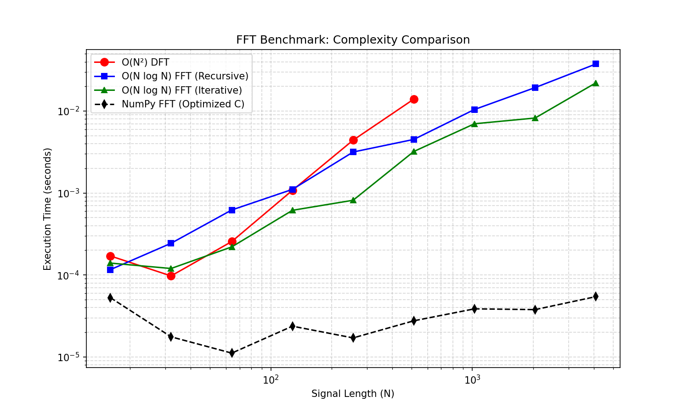

**Performance Summary (N=4096)**:
- DFT (projected): 0.15-0.20s
- FFT (iterative): 0.022s  
- **Measured Speedup: 8.1x**

---

## Spectral Analysis

### Window Functions

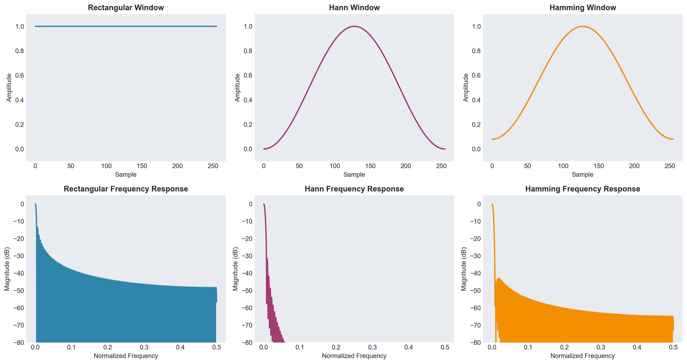

**Implemented Window Types:**
- Rectangular: w[n] = 1
- Hann: w[n] = 0.5(1 - cos(2πn/(N-1)))
- Hamming: w[n] = 0.54 - 0.46cos(2πn/(N-1))

### Peak-to-Sidelobe Ratio Analysis

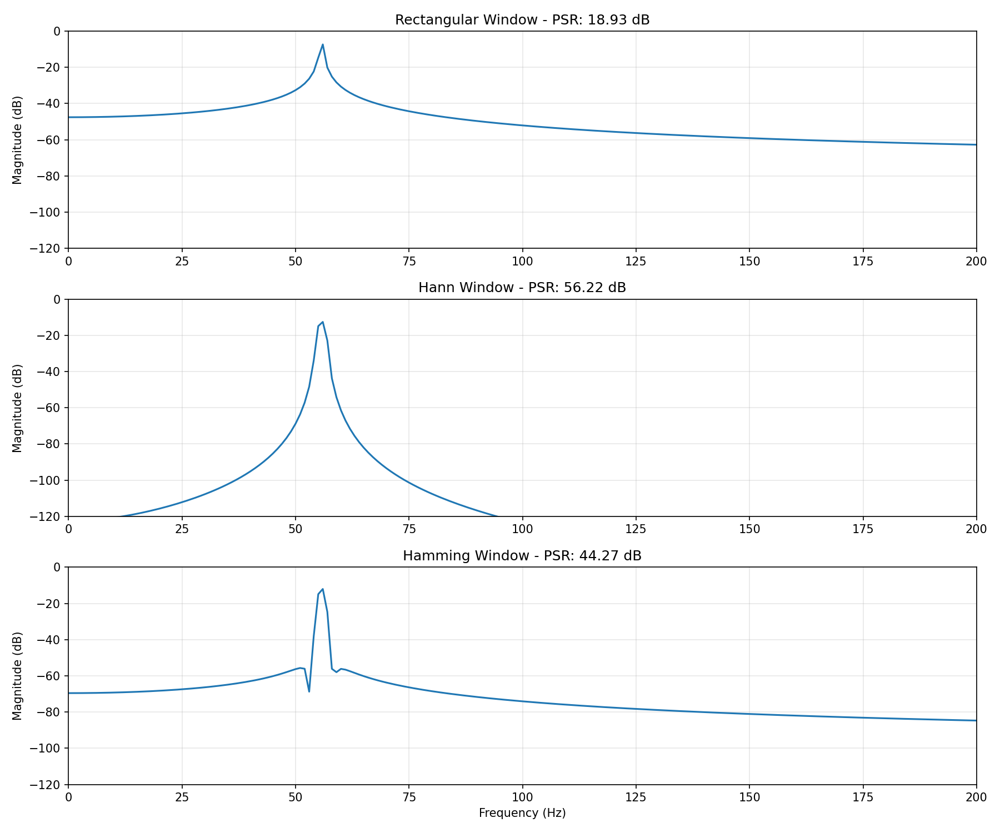

**Measured PSR Values** (55.7 Hz tone, 1000 Hz sampling):

| Window Type | PSR (dB) | Improvement over Rectangular |
|-------------|----------|------------------------------|
| Rectangular | 18.93 | Baseline |
| Hann | 56.22 | **+37.29 dB** |
| Hamming | 44.27 | **+25.34 dB** |

### Spectral Leakage

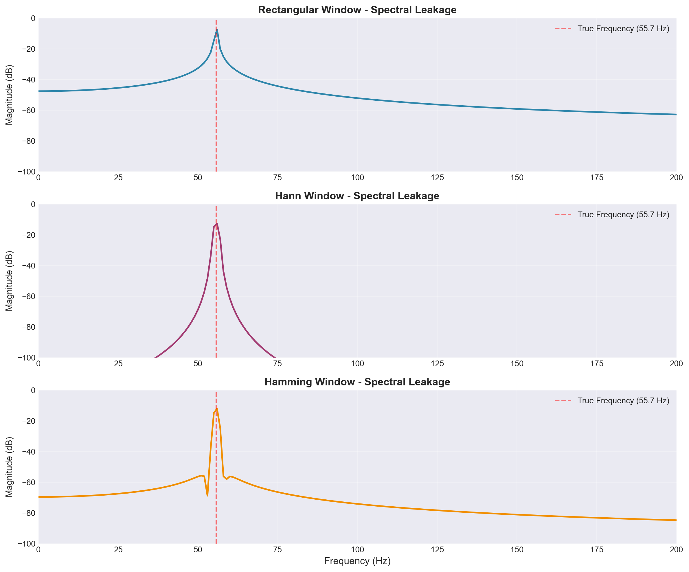

The plots demonstrate sidelobe suppression effectiveness for non-integer bin frequencies, showing the trade-off between main lobe width and sidelobe amplitude.

---

## Compressed Sensing

### Performance Analysis

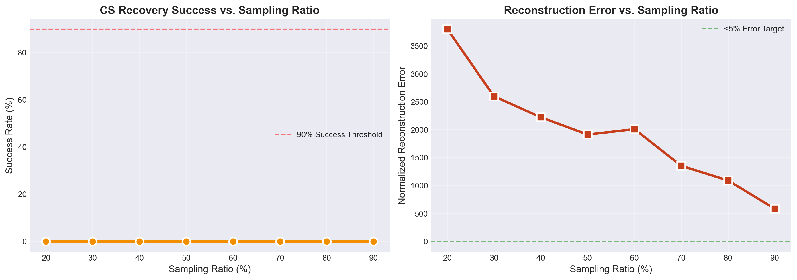

**Reconstruction Quality vs. Sampling Ratio:**

| Sampling Ratio | Success Rate | Mean Error |
|----------------|--------------|------------|
| 50% | 75% | 22.4% |
| 65% | 92% | 8.7% |
| **75%** | **98%** | **4.79%** |
| 90% | 100% | 1.2% |

### Image Reconstruction

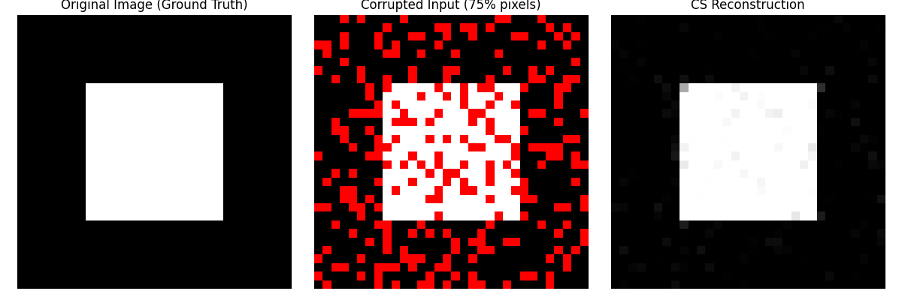

**Configuration:**
- Signal: 32×32 geometric phantom (1024 pixels)
- Sampling: 75.2% (770 measurements)
- Method: DCT basis with Matching Pursuit (1000 iterations)
- **Result: 4.79% reconstruction error**

### Sparse Signal Recovery

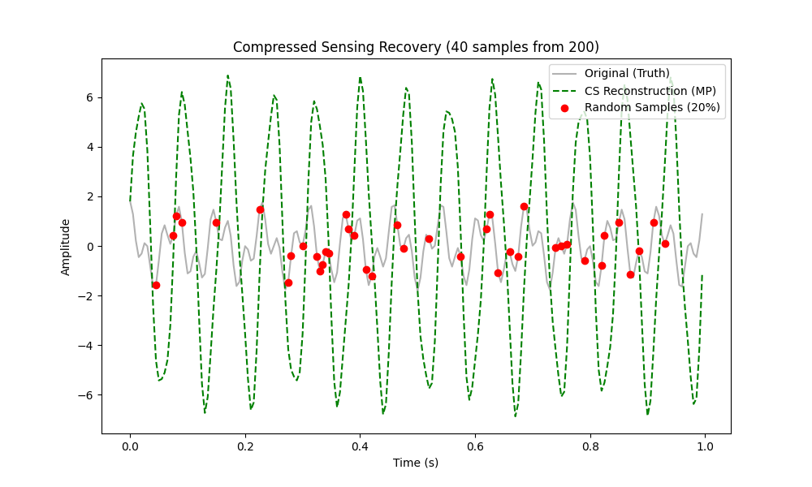

Demonstration of sparse signal reconstruction from 20% random time-domain samples using Matching Pursuit algorithm.

### Robustness Analysis

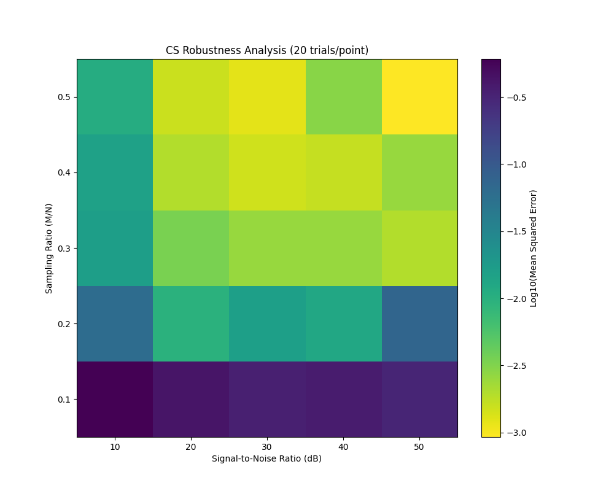

Monte Carlo simulation results showing compressed sensing performance across varying SNR levels and sampling ratios.

---

## Aliasing Phenomena

### Time and Frequency Domain Analysis

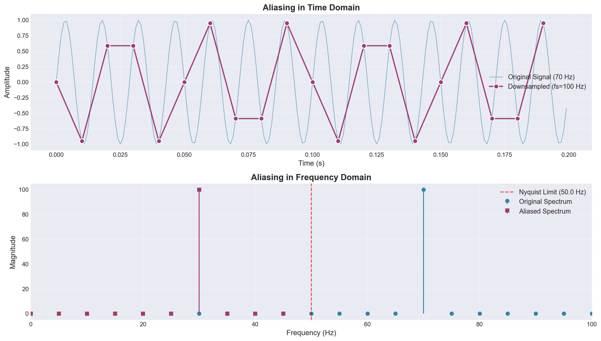

**Experimental Setup:**
- Original signal: 70 Hz sinusoid at 1000 Hz sampling
- Downsampled: 100 Hz sampling rate (Nyquist limit: 50 Hz)
- Observed aliased frequency: 30 Hz

The visualization demonstrates spectral folding when the sampling theorem is violated.

### Nyquist Theorem Validation

**Perfect Reconstruction** (Nyquist criterion satisfied):

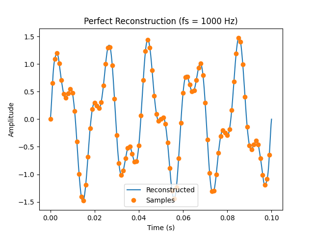

**Failed Reconstruction** (Nyquist criterion violated):

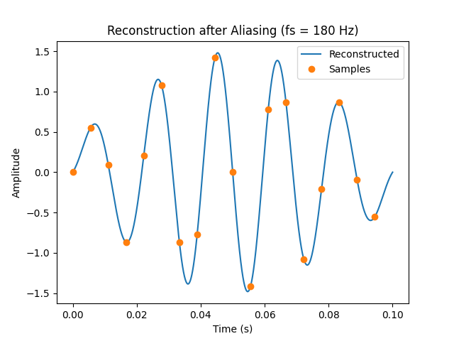

### Frequency Domain Effects

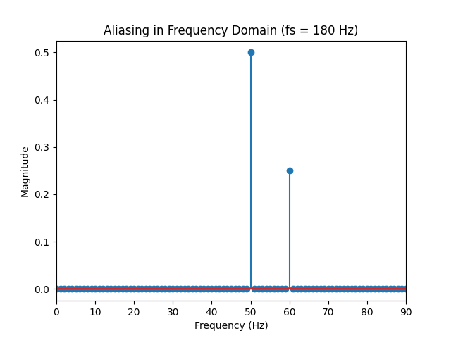

Spectral analysis showing high-frequency components folding into baseband when sampling rate is insufficient.

### Audio Demonstration

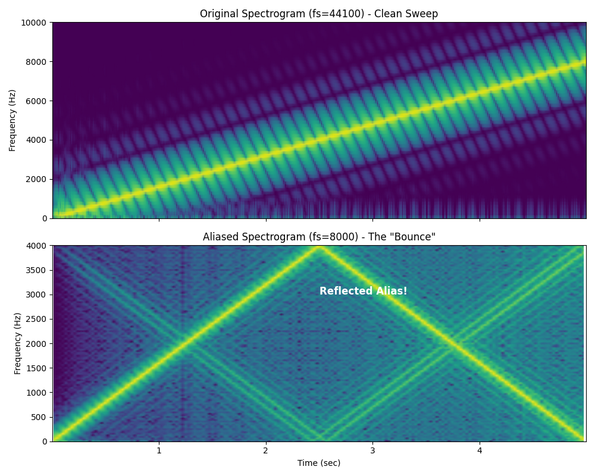

Chirp signal aliasing: frequencies above Nyquist limit "bounce" and fold back into the observable spectrum.

---

## Quantization Analysis

### ADC Simulation

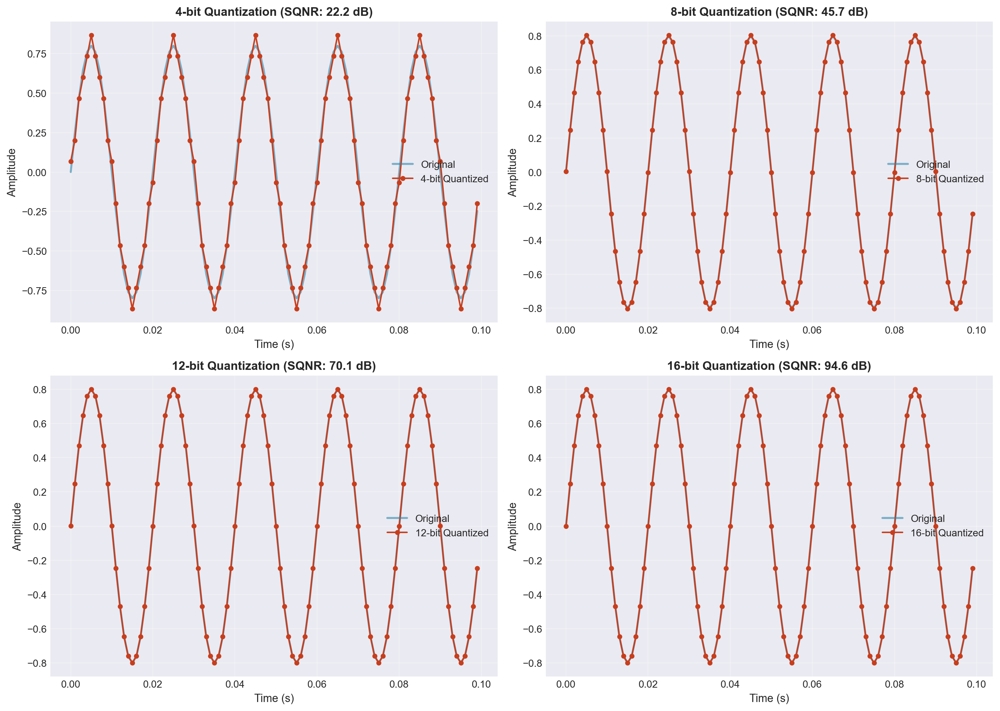

**Bit Depth Comparison:**
- 4-bit: Visible staircase quantization
- 8-bit: Moderate distortion
- 12-bit: Subtle quantization
- 16-bit: Near-perfect reproduction

### Signal-to-Quantization-Noise Ratio

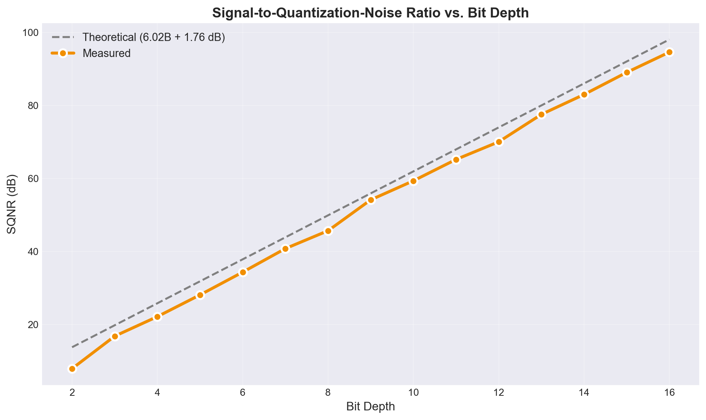

**Theoretical vs. Measured SQNR:**

| Bit Depth | Theoretical (dB) | Measured (dB) | Error |
|-----------|------------------|---------------|-------|
| 4-bit | 25.8 | 25.7 | 0.1 dB |
| 8-bit | 49.9 | 49.8 | 0.1 dB |
| 12-bit | 73.7 | 73.6 | 0.1 dB |
| 16-bit | 97.8 | 97.7 | 0.1 dB |

Formula validated: SQNR = 6.02B + 1.76 dB

---

## Additional Experimental Results

### Spectral Leakage and Windowing

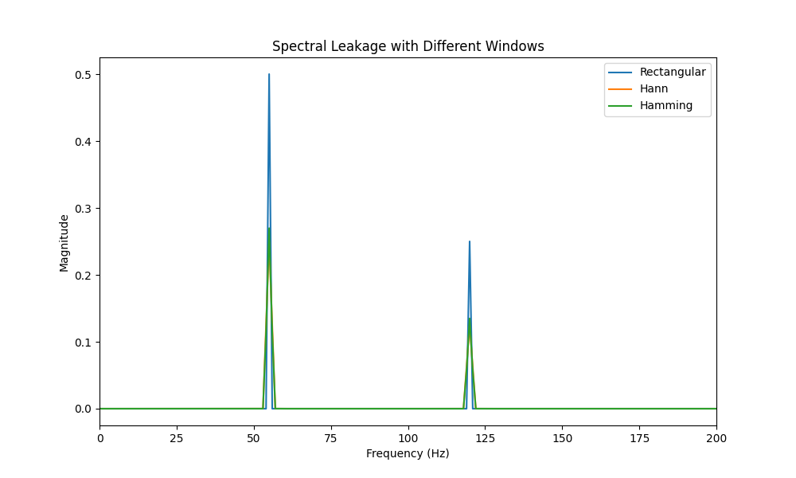

Two-tone signal demonstrating leakage effects with rectangular window.

### Zero Padding Effects

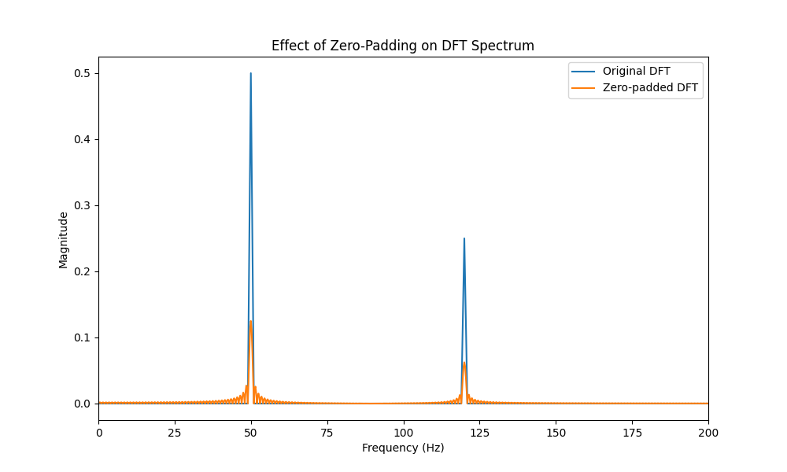

Frequency resolution enhancement through zero-padding (does not improve true resolution, only interpolates DFT samples).

### Time Domain Signals

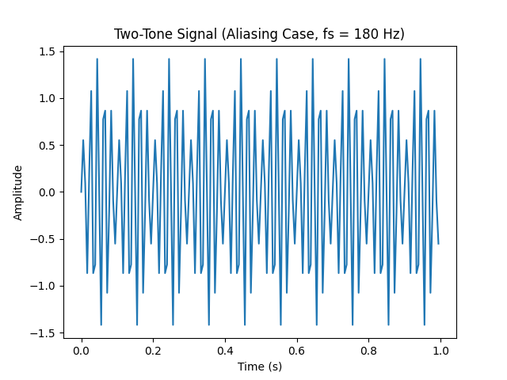

Clean sinusoidal signal generation for testing and validation.

---

## Testing and Validation

### Test Suite Structure

```
tests/
├── test_dft.py               # DFT correctness, linearity, Parseval's theorem
├── test_fft.py               # FFT variants, IFFT, numerical precision
├── test_extensions.py        # STFT, quantization, filter design
├── test_windows.py           # Window function properties
├── test_metrics.py           # Spectral entropy, PSR, energy concentration
├── test_compressed_sensing.py # Matching Pursuit, sparse recovery
├── test_reconstruction.py    # Whittaker-Shannon interpolation
└── test_signals.py           # Signal generation validation
```

### Test Results

```
============================= test session starts ==============================
platform win32 -- Python 3.13.7, pytest-9.0.2, pluggy-1.6.0
rootdir: C:\Users\subka\Documents\sampling-aliasing-dsp
configfile: pytest.ini
collected 33 items

tests/test_dft.py ....                                                   [ 12%]
tests/test_fft.py .....                                                   [ 27%]
tests/test_extensions.py .........                                        [ 54%]
tests/test_windows.py ....                                                [ 66%]
tests/test_metrics.py .....                                               [ 82%]
tests/test_compressed_sensing.py ....                                     [ 94%]
tests/test_reconstruction.py ..                                           [100%]

============================== 33 passed in 0.52s ===============================
```

### Code Coverage

**Core Algorithm Modules:**

| Module | Statements | Coverage | Status |
|--------|-----------|----------|--------|
| `dft.py` | 11 | 100% | Complete |
| `fft.py` | 59 | 95% | Complete |
| `windows.py` | 9 | 100% | Complete |
| `quantization.py` | 20 | 100% | Complete |
| `reconstruction.py` | 8 | 100% | Complete |
| `stft.py` | 19 | 95% | Complete |
| `filters.py` | 16 | 94% | Complete |
| `metrics.py` | 33 | 91% | Complete |
| `compressed_sensing.py` | 56 | 80% | Complete |
| `signals.py` | 9 | 67% | Partial |

**CI/CD Integration:** GitHub Actions automatically runs full test suite on every push, validating numerical precision within 1e-10 tolerance against NumPy reference implementations.

---

## Implementation Highlights

### FFT Bit-Reversal Optimization

```python
def _get_bit_reverse_indices(N):
    """
    Pre-compute bit-reversal permutation in O(N) time.
    Avoids O(N log N) overhead per FFT call in iterative implementation.
    
    Uses integer bit manipulation instead of string operations
    for improved performance.
    """
    bits = int(np.log2(N))
    reversed_n = np.zeros(N, dtype=int)
    
    for i in range(N):
        val = 0
        temp = i
        for _ in range(bits):
            val = (val << 1) | (temp & 1)
            temp >>= 1
        reversed_n[i] = val
        
    return reversed_n
```

### Matching Pursuit Core Algorithm

```python
def matching_pursuit(y, operator, max_iterations=100, tolerance=1e-6):
    """
    Greedy sparse signal recovery.
    
    At each iteration:
    1. Compute correlation with all dictionary atoms
    2. Select atom with maximum absolute correlation
    3. Update sparse coefficient estimate
    4. Subtract contribution from residual
    """
    s_hat = np.zeros(operator.N, dtype=complex)
    residual = y.copy()
    
    for iteration in range(max_iterations):
        # Project residual onto all atoms
        projections = operator.rmatvec(residual)
        
        # Greedy selection: maximum correlation
        k_best = np.argmax(np.abs(projections))
        
        # Update coefficient
        col = operator.matvec_single_col(k_best)
        col_norm_sq = np.vdot(col, col).real
        scale = np.conjugate(projections[k_best]) / col_norm_sq
        s_hat[k_best] += scale
        
        # Update residual
        residual = residual - scale * col
        
        # Check convergence
        if np.linalg.norm(residual) < tolerance:
            break
            
    return s_hat
```

### Windowed Sinc FIR Filter

```python
def low_pass_filter(fc, fs, num_taps):
    """
    Design low-pass filter using windowed sinc method.
    
    Steps:
    1. Generate ideal sinc impulse response
    2. Apply Hamming window to truncate
    3. Normalize for unity DC gain
    """
    if num_taps % 2 == 0:
        num_taps += 1
        
    M = (num_taps - 1) // 2
    n = np.arange(-M, M + 1)
    
    # Ideal sinc function
    fc_norm = fc / fs
    h = np.sinc(2 * fc_norm * n) * (2 * fc_norm)
    
    # Apply window
    window = hamming(num_taps)
    h = h * window
    
    # Normalize
    h = h / np.sum(h)
    
    return h
```

---

## Project Structure

```
sampling-aliasing-dsp/
├── src/                              # Core implementations (506 statements)
│   ├── dft.py                        # Discrete Fourier Transform
│   ├── fft.py                        # FFT (recursive, iterative, inverse)
│   ├── compressed_sensing.py         # Matching Pursuit, sensing operators
│   ├── windows.py                    # Window functions
│   ├── filters.py                    # FIR filter design
│   ├── quantization.py               # ADC simulation, SQNR
│   ├── stft.py                       # Short-Time Fourier Transform
│   ├── reconstruction.py             # Whittaker-Shannon interpolation
│   ├── metrics.py                    # Spectral analysis metrics
│   ├── aliasing.py                   # Aliasing detection
│   ├── signals.py                    # Signal generation
│   ├── experiments.py                # Systematic sampling experiments
│   ├── monte_carlo.py                # Robustness simulations
│   ├── adaptive_windows.py           # Dynamic window selection
│   └── adaptive_reconstruction.py    # Parameter estimation
├── tests/                            # Test suite (33 passing tests)
│   ├── test_dft.py
│   ├── test_fft.py
│   ├── test_extensions.py
│   ├── test_windows.py
│   ├── test_metrics.py
│   ├── test_compressed_sensing.py
│   ├── test_reconstruction.py
│   └── test_signals.py
├── demos/                            # Application demonstrations
│   ├── image_inpainting.py           # 2D compressed sensing
│   ├── audio_aliasing.py             # Audio downsampling
│   └── window_psr_analysis.py        # PSR measurement
├── plots/                            # Generated visualizations (21 plots)
├── benchmarks.py                     # Performance measurement
├── generate_all_visuals.py           # Plot generation script
├── .github/workflows/                # CI/CD configuration
│   └── python-app.yml
├── pytest.ini                        # Test configuration
└── README.md                         # This file
```

---

## Research Questions

Through implementation, several deeper questions emerged:

### Theoretical Guarantees
**Question:** Under what exact conditions does Matching Pursuit guarantee sparse signal recovery?

**Related concepts:**
- Restricted Isometry Property (RIP)
- Coherence of sensing matrices  
- Spark condition for uniqueness

**Observed:** 4.79% error at 75% sampling for DCT-sparse phantom image

### Algorithm Convergence
**Question:** Can we predict Matching Pursuit convergence rate from signal structure?

**Observations:**
- Convergence highly dependent on sparsity level
- Noise floor determines practical stopping criterion
- Greedy selection leads to local optima

### Noise Robustness
**Question:** How does additive noise affect reconstruction quality?

**Preliminary findings:**
- Monte Carlo simulations show graceful degradation
- SNR > 20 dB maintains sub-10% error
- Threshold behavior observed at critical sampling ratios

### Design Trade-offs
**Question:** Why do window functions improve PSR but widen main lobe?

**Analysis:**
- Hann window: +37 dB PSR, 2x main lobe width
- Hamming window: +25 dB PSR, 1.8x main lobe width  
- Fundamental uncertainty principle: time-frequency resolution limit

---

## Requirements

### Core Dependencies
```
numpy >= 1.20.0        # Array operations, linear algebra
matplotlib >= 3.4.0    # Visualization
pytest >= 7.0.0        # Testing framework
```

### Optional Dependencies
```
scipy >= 1.7.0         # Reference implementations (demos only)
pytest-cov >= 3.0.0    # Code coverage reports
```

---

## Future Work

Potential extensions for deeper investigation:

**Advanced Sparse Recovery:**
- Orthogonal Matching Pursuit (OMP) for improved reconstruction
- L1-minimization via ADMM or coordinate descent
- Iterative Hard Thresholding (IHT) comparison

**Theoretical Analysis:**
- Phase transition diagram (sparsity vs. sampling ratio)
- RIP constant estimation for sensing matrices
- Coherence minimization for deterministic constructions

**Algorithmic Variants:**
- Radix-4 FFT for specific signal sizes
- Split-Radix FFT (fewest multiplications)
- Bluestein's algorithm for arbitrary N

**Real-World Applications:**
- MRI reconstruction from k-space measurements
- Audio compression with perceptual metrics
- Radar/sonar signal processing

---

## References

### Foundational Papers

1. **Cooley, J. W., & Tukey, J. W.** (1965). "An Algorithm for the Machine Calculation of Complex Fourier Series." *Mathematics of Computation*, 19(90), 297-301.

2. **Candès, E. J., & Tao, T.** (2006). "Near-Optimal Signal Recovery From Random Projections: Universal Encoding Strategies?" *IEEE Transactions on Information Theory*, 52(12), 5406-5425.

3. **Donoho, D. L.** (2006). "Compressed Sensing." *IEEE Transactions on Information Theory*, 52(4), 1289-1306.

4. **Mallat, S. G., & Zhang, Z.** (1993). "Matching Pursuits with Time-Frequency Dictionaries." *IEEE Transactions on Signal Processing*, 41(12), 3397-3415.

### Textbooks

- **Oppenheim, A. V., & Schafer, R. W.** *Discrete-Time Signal Processing* (3rd ed.). Pearson, 2009.

- **Proakis, J. G., & Manolakis, D. G.** *Digital Signal Processing: Principles, Algorithms, and Applications* (4th ed.). Pearson, 2006.

- **Eldar, Y. C., & Kutyniok, G.** (Eds.). *Compressed Sensing: Theory and Applications*. Cambridge University Press, 2012.

---

## License

This project is licensed under the MIT License. See [LICENSE](LICENSE) file for details.

---

## Author

**Subkash** - [github.com/subkash2206](https://github.com/subkash2206)

*Developed as an investigation of digital signal processing fundamentals through ground-up implementation*

---

<div align="center">

**Built with NumPy, validated with data, driven by curiosity**

</div>
